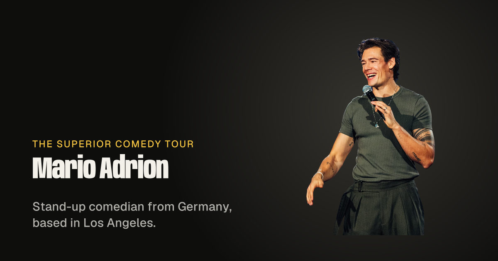

# marioadrion.com

The website of Mario Adrion, stand-up comedian: tour dates, his debut special
_My Struggle_, and the one thing the old site asked and never collected, which
city he should play next.

Built on [Stacks](https://stacksjs.com) with stx templates and Crosswind.

## What it does

- **Tour dates, server-rendered.** Read from the Bandsintown API on the server
  (`resources/data/shows.ts`), cached for 15 minutes, grouped into venue runs
  under sticky month labels. The old site's widget was an iframe that search
  engines never saw. If Bandsintown is down the page serves the last good copy,
  then a committed snapshot, never an empty tour.
- **Right times everywhere.** Bandsintown publishes the time on the ticket with
  no zone. Each show is pinned to its venue's zone (`resources/data/zones.ts`)
  and converted with `zonedTimeToUtc` from `@stacksjs/datetime`, so the
  schema.org `startDate` and the calendar feed carry real instants.
- **Search.** A `ComedyEvent` in JSON-LD for every show, plus the `Person`
  graph, a social card, a sitemap and `robots.txt`.
- **Calendar feed.** `/tour.ics`, every date as one subscribable calendar
  (`@stacksjs/calendar-api`).
- **"Tell me where to perform."** A `@stacksjs/forms` form with the framework's
  honeypot, minimum fill time and rate limit. Answers land in `form_submissions`
  and export as CSV.
- **The special, without YouTube on every visit.** A poster facade that loads
  the privacy-enhanced embed only when someone presses play.
- **No third-party requests on load.** Fonts and photos are served from this
  origin.

## Develop

```bash
./buddy dev          # http://localhost:3410
./buddy migrate      # creates the forms tables
./buddy lint
./buddy typecheck
```

## Photos and generated images

Originals live in `resources/images`; nothing in `public/images` is edited by
hand.

```bash
./buddy images:build     # responsive WebP + fallbacks, via @stacksjs/image
./buddy generate:images  # social cards, favicons, web manifest (config/images.ts)
```

`resources/data/photos.ts` lists every photo with its widths and alt text, and
the `<Photo>` component renders from the manifest the build writes.

## Content

Copy, links and photography come from Mario's own site and channels. Tour
dates come from Bandsintown and are managed there.
